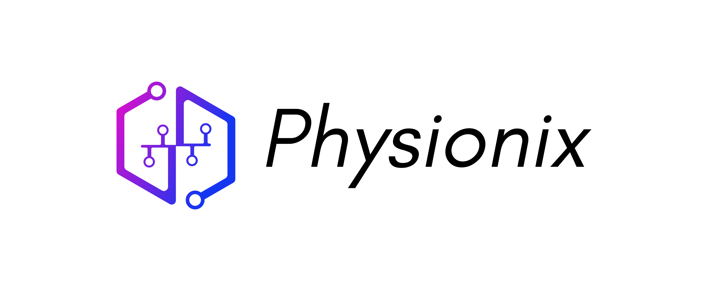

## Your personal physiotherapist
**Consult your physiotherapist from the comfort of your home**

Our application is capable of detecting even the slightest motion of your muscles, helping you to complete your physio regimen to help you make the most of it. No more worries about over-straining or under-engaging your muscles. Our application is focused on delivering optimum power to aid you in your exercises and to help you become a better you.

We have releases with our binaries for the Raspberry Pi 4B. You can download them from the [Releases](https://github.com/satanb4/physionix/releases) section.

# How to Build
Building this repository is easy. All code is built with a simple build script that takes care of dependencies as well.  
Make sure to have root access to your system.  
Just follow the steps below:
- Login to your Raspberry Pi Machine  
**If Required** Install Git
   ```sh
   sudo apt-get update
   sudo apt-get install -y git
   ```
- Clone the repository
   ```sh
   $ git clone https://github.com/satanb4/physionix.git
   $ cd $HOME/physionix
   ```
- Install the dependencies and build
  ```sh
  chmod +x build.sh
  ./build.sh
  ```
- The application will be present in the `build` folder
  
# Our Socials

  
[Instagram](https://www.instagram.com/the_physionix/)  
[Youtube Channel](https://www.youtube.com/@The_Physionix/featured)  
[Twitter](https://twitter.com/The_Physionix)  

# Contributing
We are open to `enhancements` & `bug-fixes` 😊    


# Contact Us 📧
- This project is developed and maintained by :
  * [Sayan Bandyopadhyay](https://github.com/satanb4)
  * [Midhun Mathew](https://github.com/midhunjac) 
  * [Sri Krishna Sumanth](https://github.com/Sumanth0201)
